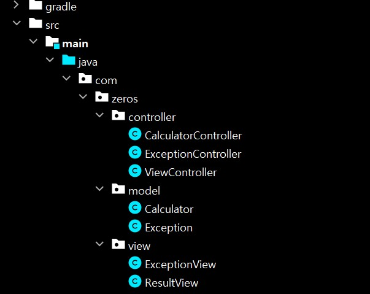

# MVC 패턴을 활용한 계산기 실습

## 프로젝트 소개
- 사칙연산을 수행하는 Web App 계산기 (+, -, *, /, %)

## 요구사항
- 사칙연산이 수학적으로 통용되는 상식선에서 정상적으로 돌아가도록 구현
- 모든 사칙 연산은 정수로 계산되도록 할 것
- 입력 값은 양의 정수만 허용되도록 할 것
- 입력 값의 경우 form>input*3로 두 개의 숫자와 text로 사칙연산을 받게 구현(input type은 num 2개, text 1개)
- 나누기의 경우 나눌 수 가 0인 경우 IllegalArgumentException이 발생하도록 구현
- try~catch를 통해 성공과 예외처리를 구분하고 예외 상황(정수에 실수 or 문자열) 발생시 400에러 처리
- 브라우저에서 submit 버튼을 통해서 입력값을 전달받아 계산을 도출

## 상세사항
- 사칙연산 기능
  * 더하기 ex) 5 + 3 = 8 정상적인 계산값을 도출하는지 확인
  * 빼기 ex) 5 - 3 = 2 정상적인 계산값을 도출하는지 확인
  * 곱하기 ex) 5 * 2 = 10 정상적인 계산값을 도출하는지 확인
  * 나누기 ex)
    + 5 / 2 = 2 정상적인 계산값을 도출하는지 확인
    + 5 / 0 으로 계산시 `예외처리`를 하는지 확인

- `예외처리` 기능
  * 0으로 나눌 때 예외처리 방법
    + IllegalArgumentException이 발생하도록 구현하고 400에러 발생 페이지를 사용자에게 보여주기
  * 잘못된 입력값을 전달 했을 때 예외처리 방법
    + IllegalArgumentException이 발생하도록 구현하고 400에러 발생 페이지를 사용자에게 보여주기

- 입력 값 전달 방법
  * HttpMethod는 POST 방식으로 전달할 것
  * 두 개의 숫자는 `<input type = "number">` 받아올 것
  * 사칙 연산자는 `<input type = "text">` 받아올 것

## 제약사항
- 가독성 있는 코드로 작성할 수 있도록 할 것
- 메소드 이름은 반드시 명령문 형태로 작성
- 테스트 메소드는 충분히 기능을 검증하도록 작성
- 개인 구현은 반드시 브랜치를 생성 후 구현할 것 (브랜치 이름은 신규인 경우 feature/기능명 형태로 작성할 것)
- 모든 개인 작업이 끝난 후 PR 생성
- PR에 모든 팀원이 코드 리뷰할 것
- 마지막 리뷰어는 Merge 수행

## 패키지 구조

- controller
  * CalculatorController : 사칙연산을 수행하는 모델을 연결해주는 컨트롤러
  * ExceptionController : 예외처리를 수행하는 모델을 연결해주는 컨트롤러
  * ViewController : 화면을 연결해주는 컨트롤러
  
- model
  * Calculator : 계산을 수행하는 로직
  * Exception : 예외를 처리하는 로직

- view
  * ExceptionView : 에러 화면
  * ResultView : 결과 화면
